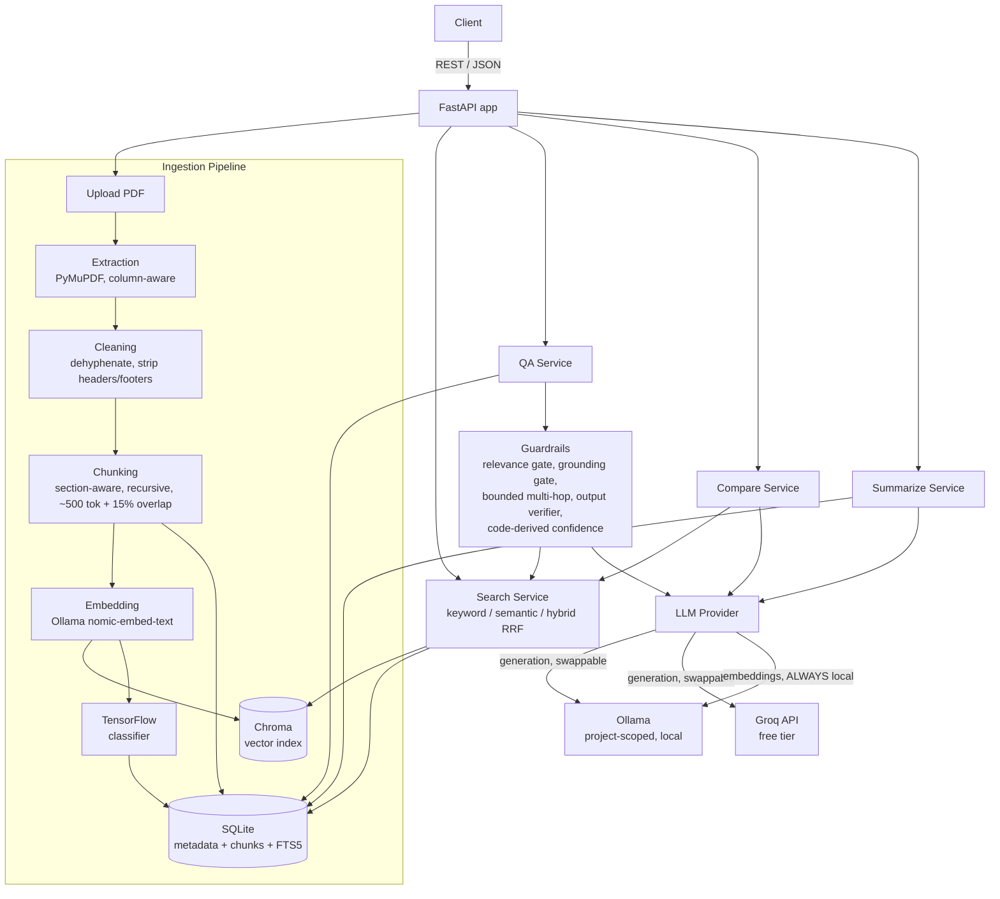

–# AI Research & Knowledge Assistant

A production-oriented RAG (Retrieval-Augmented Generation) backend for uploading technical/research PDFs, searching and asking grounded questions over them with citations, comparing and summarizing documents, and automatically classifying them with a trained TensorFlow model.

Built for minimalism and low latency: no separate vector-DB server, no heavy NLP framework, embeddings run locally and are reused for classification, and every provider (LLM/embeddings) sits behind a single swappable interface.

## 1. Project Overview

The assistant lets a user:

- Upload one or more PDFs, which are automatically extracted, cleaned, chunked, embedded, indexed, and classified
- Search across all uploaded documents with keyword, semantic, or hybrid (RRF) retrieval
- Ask questions answered **only** from retrieved context, with source documents, page numbers, retrieved context, and a code-computed confidence score — the assistant explicitly says so if it can't answer from the documents
- Compare 2+ documents across methodology/approach/conclusions/etc.
- Generate four kinds of summaries (executive, technical, bullet points, key takeaways)
- Have multi-turn conversations where follow-ups like "What are its limitations?" resolve to the right document automatically
- View basic analytics (documents, chunks, embeddings, most-queried documents, questions answered)

A dedicated **guardrails layer** (see §9) sits in front of every LLM call: it refuses off-topic questions before spending an LLM call, refuses to answer when retrieval evidence is weak, bounds multi-hop reasoning so it can't compound into hallucination, and verifies every citation the model returns actually exists in what was retrieved.

## 2. Architecture



**Key structural decision:** embeddings *always* run through the local, project-scoped Ollama instance — regardless of which provider is generating answers (Ollama or Groq) — so the vector index, the classifier's features, and retrieval all share one consistent embedding space, and embeddings never cost money or leave the machine.

## 3. Technology Stack

| Layer | Choice | Why |
|---|---|---|
| API framework | FastAPI (Python 3.9+) | Async REST + automatic Swagger/OpenAPI docs |
| Metadata store | SQLite + SQLAlchemy 2.0 | Zero-setup, file-based, matches the minimalism goal |
| Keyword search | SQLite FTS5 (`bm25()`), external-content table synced via triggers | No separate search engine; index never drifts from `chunks` |
| Vector store | ChromaDB (embedded, `PersistentClient`) | No server process to run/manage; cosine space |
| PDF extraction | PyMuPDF (`fitz`) | Block-coordinate aware — handles 2-column IEEE/ACM layouts correctly |
| LLM generation | Ollama (local, default) or Groq (free tier) behind one interface | See §7 for the pathway comparison |
| Embeddings | Ollama `nomic-embed-text` (768-dim), always local | Free, no rate limits, reused for classification features |
| Classification | TensorFlow/Keras, small feedforward net over embeddings | Reuses ingestion embeddings — no second feature pipeline |
| Dataset (classifier) | arXiv public API (no key) | Free, real technical abstracts mapped to the 7 categories |

## 4. Setup Instructions

Requires Python 3.9–3.12 and ~5GB free disk (for local models). No Docker, no external services, no system-wide installs.

```bash
# 1. Create and activate a virtualenv
python3 -m venv .venv
source .venv/bin/activate   # Windows: .venv\Scripts\activate

# 2. Install dependencies (API runtime, includes TensorFlow for the prediction API)
pip install -r requirements.txt

# 3. Set up Ollama — downloaded into ./bin, models stored in ./data/ollama_models.
#    Nothing is installed system-wide or touches ~/.ollama.
./scripts/setup_ollama.sh
BACKGROUND=1 ./scripts/run_ollama.sh
./scripts/pull_models.sh

# 4. Configure environment
cp .env.example .env
# Edit .env: add GROQ_API_KEY if using the Groq pathway (see §7), or leave
# GENERATION_PROVIDER=ollama for a fully offline setup.

# 5. Run the API
uvicorn app.main:app --reload
# Swagger UI: http://127.0.0.1:8000/docs
```

**Train the classifier** (optional — the API works without it, documents are just left uncategorized until this has been run once):

```bash
pip install -r requirements-ml.txt   # adds scikit-learn on top of requirements.txt
python -m app.ml.train_classifier
```

This fetches ~400 labeled abstracts/category from the arXiv API (cached under `data/classifier/raw/`), embeds them via the local Ollama instance, trains a small Keras classifier, evaluates it, and persists it to `data/classifier/model/`. Takes a few minutes, mostly spent on embedding generation.

**Run tests:**
```bash
pip install -r requirements-dev.txt
pytest tests/unit -q
```

## 5. Environment Variables

See `.env.example` for the full list with defaults. Highlights:

| Variable | Purpose |
|---|---|
| `GENERATION_PROVIDER` | `ollama` (fully local) or `groq` (free-tier, low latency) — see §7 |
| `FALLBACK_TO_LOCAL_ON_ERROR` | If the active generation provider errors, retry once via local Ollama |
| `OLLAMA_BASE_URL` / `OLLAMA_GENERATION_MODEL` / `OLLAMA_EMBEDDING_MODEL` | Project-scoped Ollama connection + model names |
| `GROQ_API_KEY` / `GROQ_MODEL` | Groq free-tier credentials, only needed if using that pathway |
| `RAG_RELEVANCE_FLOOR` / `RAG_MIN_SIMILARITY` | Guardrail thresholds (§9) — below floor: refuse as off-topic; below min-similarity: "cannot be determined" |
| `RAG_MAX_HOPS` / `RAG_MAX_HOP_CHUNKS` | Bounds on the multi-hop controller |
| `CHUNK_TARGET_CHARS` / `CHUNK_OVERLAP_CHARS` | Chunking size/overlap (§8) |

## 6. API Documentation

Full interactive docs at `/docs` (Swagger) once running; a Postman collection is at `postman/rag_assistant.postman_collection.json`.

| Method & Path | Purpose |
|---|---|
| `POST /api/v1/documents` | Upload one or more PDFs (multipart) — kicks off async pipeline |
| `GET /api/v1/documents` | List documents (filter by `status`/`category`, paginated) |
| `GET /api/v1/documents/{id}` | Get metadata + processing status + category |
| `DELETE /api/v1/documents/{id}` | Delete a document (cascades chunks, vectors, FTS rows) |
| `POST /api/v1/documents/{id}/reprocess` | Re-run the ingestion pipeline |
| `GET /api/v1/documents/{id}/chunks` | Inspect generated chunks (debugging) |
| `POST /api/v1/documents/{id}/summarize` | Executive / technical / bullet / key-takeaway summaries |
| `POST /api/v1/search` | `{query, mode: keyword\|semantic\|hybrid, document_ids?, top_k?}` |
| `POST /api/v1/qa` | `{question, conversation_id?, document_ids?}` → grounded answer + citations + confidence |
| `POST /api/v1/compare` | `{document_ids: [>=2], aspects?}` → structured multi-doc comparison |
| `POST /api/v1/classify/{id}` | Force (re-)classification |
| `GET /api/v1/classify/categories` | List the 7 target categories |
| `POST /api/v1/conversations` | Start a session |
| `GET /api/v1/conversations` / `/{id}` | List / get history |
| `DELETE /api/v1/conversations/{id}` | Delete a session |
| `GET /api/v1/analytics/overview` | Doc/chunk/embedding counts, questions answered |
| `GET /api/v1/analytics/top-documents` | Most-queried documents |
| `GET /health`, `GET /health/llm` | Liveness + active provider reachability |

## 7. Cost-Optimized LLM Pathways

The `LLMProvider` interface (`app/services/llm/`) makes generation swappable via one env var; embeddings always stay local regardless of choice.

| | **Pathway A — Fully local** | **Pathway B — Groq + local embeddings (default)** | **Pathway C — Fully hosted (future work)** |
|---|---|---|---|
| Generation | Ollama `llama3.1:8b`, local | Groq `llama-3.1-8b-instant` (free tier) | e.g. Gemini free tier |
| Embeddings | Ollama `nomic-embed-text`, local | Ollama `nomic-embed-text`, local (unchanged) | Would need a new provider — not built in v1 |
| Cost | $0 | $0 (within free-tier limits) | $0 within limits |
| Latency | Hardware-dependent, several sec/answer on CPU | Lowest & most consistent (Groq LPU inference) | Good, network-bound |
| Offline | Fully | No (generation needs internet) | No |
| Setup | Highest (model download, local server lifecycle) | Lowest incremental (just an API key) | Low, but requires implementing `GeminiProvider` |
| Best for | Privacy/offline demo, unreliable grading-machine internet | Live demo — lowest latency, zero cost | Escape hatch if local Ollama can't run at all |

Switch with `GENERATION_PROVIDER=ollama|groq` in `.env` — no code changes needed either way.

## 8. Chunking Strategy (justification)

1. **Extraction** via PyMuPDF's block coordinates, sorted column-major (left column top-to-bottom, then right column) — correctly reconstructs reading order for standard 2-column academic layouts, unlike naive linear text extraction.
2. **Cleaning**: de-hyphenates line-wrapped words, strips running headers/footers (lines repeated on ≥30% of pages), strips standalone page-number lines, Unicode NFKC normalizes (fixes ligatures like fi/fl).
3. **Chunking**: section-aware (detects headings via a standard paper-heading vocabulary — Abstract, Introduction, Methodology, Results, Conclusion, etc.) then recursively splits within each section on paragraph → sentence boundaries, **never breaking mid-sentence**.
   - **Target ~500 tokens (~2,000 chars), ~15% (~300 char) overlap.**
   - *Why 500 tokens:* large enough to capture one coherent idea/paragraph (a full methodology step, a full result) without diluting a single embedding vector with unrelated adjacent content — this serves both retrieval precision and clean, quotable citations.
   - *Why 15% overlap:* enough to prevent a key sentence from being orphaned exactly at a chunk boundary, without materially bloating the index (50% overlap would roughly double storage/retrieval noise for little accuracy gain).
   - Trailing fragments under 200 chars are merged into the previous chunk rather than left as their own tiny, low-value chunk.
4. **Search modes**: keyword = SQLite FTS5 `bm25()`; semantic = Chroma cosine similarity; hybrid = Reciprocal Rank Fusion (k=60) over both — rank-based fusion sidesteps the fact that bm25 and cosine scores live on incompatible scales, with no score normalization/tuning required. QA's own retrieval gates on cosine similarity (its thresholds are calibrated in similarity units) but merges in keyword recall once the gate has passed, since short/paraphrased follow-up questions (e.g. "what are its limitations?") regularly under-rank on pure embedding similarity.

## 9. Guardrails

Implemented in `app/services/guardrails/`, directly addressing: *"when irrelevant info is generated or asked about, the RAG must return an outbound message"* and *"minimize hallucination, especially across multi-hop/inference chains."*

1. **Input/relevance gate** (`retrieval_gate.py`): a small deterministic deny-list catches prompt-injection phrasing ("ignore previous instructions") before any retrieval. One retrieval call then doubles as both the relevance check and the grounding check:
   - top similarity below `RAG_RELEVANCE_FLOOR` (0.15) → refuse as off-topic, **no LLM call spent**
   - top similarity below `RAG_MIN_SIMILARITY` (0.35) → "cannot be determined from the available documents" per spec 4.4
2. **Bounded multi-hop controller** (`multihop_controller.py`): only triggered for detected multi-clause/relational queries, capped at `RAG_MAX_HOPS=2`. Every "hop" is a real retrieval call — never an invented reasoning step — and the total context pool is capped (`RAG_MAX_HOP_CHUNKS`) so the reasoning chain can't grow unbounded.
3. **Output verifier** (`output_verifier.py`): the LLM must return structured JSON (`answer`, `citations[{chunk_id}]`, `insufficient_evidence`). Code-side, never trusting the LLM's self-report: schema validation (a wrong-shaped JSON triggers one retry with a stricter prompt), strips any citation not in the actually-retrieved set, and strips any answer sentence whose lexical overlap with its cited chunk falls below `RAG_VERIFY_THRESHOLD` — if every sentence gets stripped, the response collapses to the standard insufficient-evidence message.
4. **Confidence score** (`confidence.py`): **code-derived, never LLM self-reported** (self-reported LLM confidence is known to be unreliable/overconfident) — `0.4×top_similarity + 0.4×citation_coverage + 0.2×(1-stripped_ratio)`, with a −0.1 penalty when multi-hop was used, bucketed High/Medium/Low.

## 10. Assumptions & Design Decisions

- **Ollama runs `/api/chat` with an explicit `num_ctx: 8192`, not `/api/generate`'s default 2048.** Discovered during testing: the default context window silently truncates/corrupts prompts once ~4+ retrieved chunks are included, causing the model to emit garbled non-JSON output. This was the actual root cause of several early "model won't follow the schema" failures — not a prompting problem.
- **`llama3.1:8b` is the local default, not the smaller/faster `llama3.2:3b`.** In testing, the 3B model reliably ignored the JSON citation schema (even after a retry with a stricter prompt); the 8B model complied consistently. Documented trade-off: swap back to 3b for faster inference on constrained hardware if you accept looser schema compliance.
- **Query expansion for anaphoric follow-ups**: a bare pronoun-only question ("What are its limitations?") embeds almost uniformly across an entire paper — there's no lexical anchor. The retrieval query (not the question shown to the LLM) is expanded with the previous turn's question when the current one is short or anaphoric, which meaningfully improves recall for legitimate follow-ups.
- **No Alembic migrations** — `Base.metadata.create_all()` at startup. This is a single-environment take-home deliverable with a fixed schema; real migration tooling is listed under Future Improvements.
- **No separate TF-IDF pipeline for the classifier** — it reuses the same Ollama embeddings already generated during ingestion, both to avoid a second feature pipeline and because dense embeddings generalize better across overlapping technical vocabulary than bag-of-words.
- **"Cloud Computing" has no exact arXiv category** — `cs.DC` (Distributed Computing) is used as the closest available proxy; documented as an accuracy limitation for that one class specifically.
- **Compare/summarize don't run the full guardrail pipeline** used by QA (no multi-hop, no per-sentence citation stripping for summarize) — summarization has no citation requirement in the spec, and compare uses the same citation-existence check as QA but without the multi-hop controller, since aspect-based comparison queries are already specific.
- **PyMuPDF is AGPL-licensed** — acceptable for this deliverable; noted here since `pypdf` (MIT) was the permissive alternative, traded off for materially better multi-column extraction fidelity.

## 11. Limitations

- Scanned/image-only PDFs are not supported (no OCR) — ingestion fails clearly with a documented error rather than silently producing empty chunks.
- Reading-order reconstruction assumes standard single/2-column layouts; documents with complex multi-column-spanning figures or tables may occasionally misorder.
- Sentence splitting is regex/punctuation-based (no NLP library) — can mis-split on abbreviations like "Fig. 3" or "e.g."; acceptable in practice, not perfect.
- Very long documents are sampled (not map-reduced) for summarization if they exceed an ~8,000-character budget, to avoid relying on providers correctly handling a very large context window.
- Multi-hop sub-question retrieval uses semantic-only search (not the hybrid keyword+semantic recall QA's main gate gets), for now.
- No authentication/multi-user support, no Docker/CI pipeline, no hybrid BM25+vector reranking model, no streaming responses — all deferred (see below) since the brief scoped this build to core functional requirements only.
- Upload processing uses FastAPI `BackgroundTasks`, not a real task queue — fine at this scale, would not survive a process restart mid-processing.

## 12. Future Improvements

- Authentication & multi-user support; Dockerization + CI/CD pipeline
- A `GeminiProvider` implementing the same `LLMProvider` interface (Pathway C)
- Cross-encoder reranking for hybrid search; streaming LLM responses
- OCR for scanned PDFs; multi-modal (image/table) document support
- Alembic migrations; a real task queue (Celery/RQ) for ingestion
- Map-reduce summarization for documents exceeding the sampling budget
- Broader automated test coverage (integration tests against a running Ollama instance)
